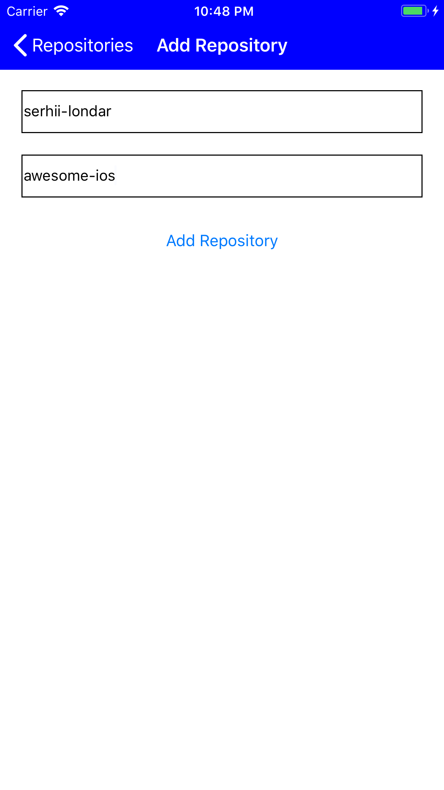
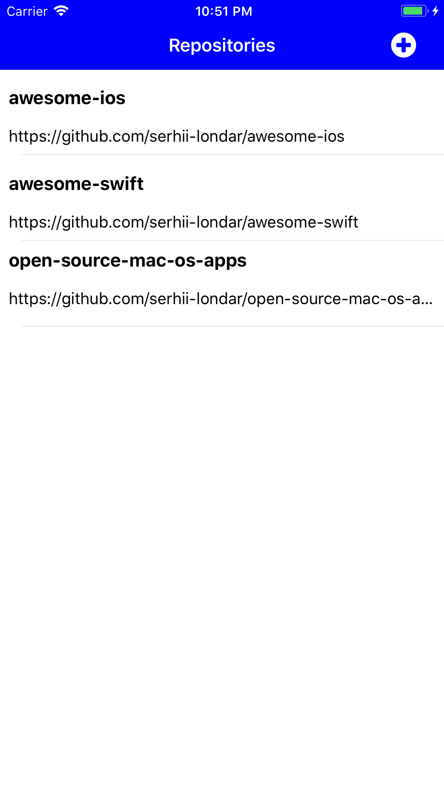
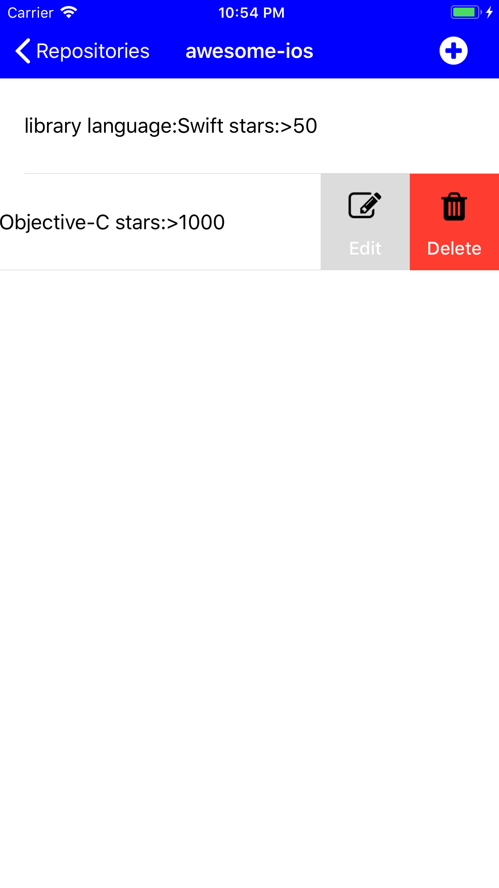
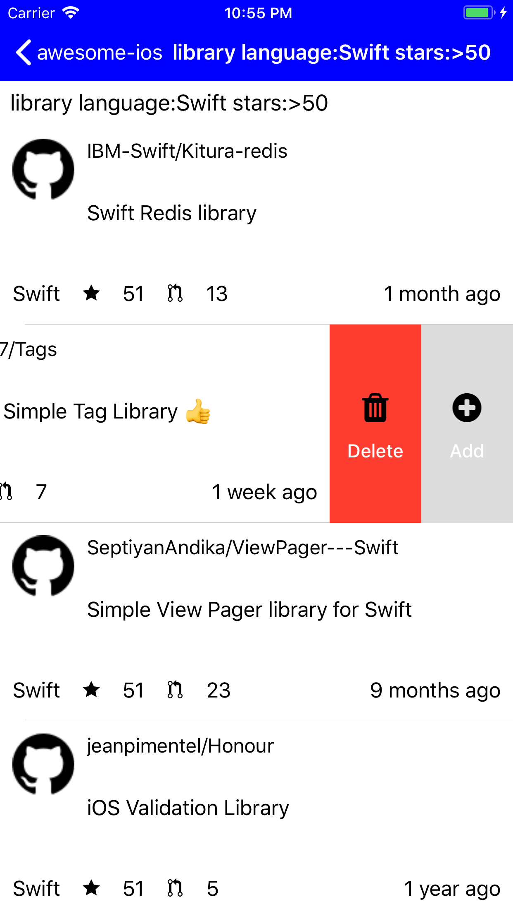
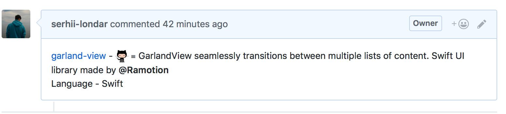

# Awesome Helper
> Small iOS utility app to help managing your favorite awesome list. 

[![Swift Version][swift-image]][swift-url]
[![License][license-image]][license-url]
[](http://cocoapods.org/pods/LFAlertController)
[](http://makeapullrequest.com)

I'm using this app to manage my repository with [List of open source applications for macOS](https://github.com/serhii-londar/open-source-mac-os-apps), and to contribute in repositories like [awesome-ios](https://github.com/vsouza/awesome-ios).

## Usage example

### Add you repository (or fork):
To do this press "+" button on the main screen and then input owner name and repository name.


<p align="center">

</p>


The repository will appear on the screen:

<p align="center">

</p>

### Add your search query:

After you press on some repository you will be redirected to the screen with the list of search queries. You can add new or edit existing queries.

<p align="center">

</p>

### Perform search repositories by query:

Once you tap on the query, you will be redirected to repositories list. This repositories list contains all repositories found by selected search query on [github.com](github.com) that are not included to your repository. Now you need to rewiew this list and find which repository you'd like to include to your awesome list. 

<p align="center">

</p>

### Add repositories to your awesome list

If you find that some repository can be added to your awesome list, just swipe it left and press "+" button. After you press "+", the app will create the issue on your repository on [github](github.com) (That's why I recommend using fork of the repository).

<p align="center">

</p>

If you press "Delete" button, the app will remember this repository on Firebase and will remove it from your search list.

### Now you are able to create a pull request 🚀

## Requirements

- iOS 11.0+
- Xcode 9.1

## How to run

1. Firs of all you need to add ``GoogleService-Info.plist`` - plist generated by Google. You need to create the app on Google console and generate this plist file. This step is required because the app is using [firebase](firebase.com). 

2. Also you need to add ``credentials.plist`` file with credentials of your [github.com](github.com) account. This file should have the following structure:

```
{
    "token": {
        "key": "token",
        "token": "your github token here"
    },
    "access_token": {
        "key": "access_token",
        "access_token": "your github token here"
    },
    "basic": {
        "username": "your github username here",
        "password": "your github password here"
    }
}
```

3. The next step is cocoapods installation. Run ``pod install`` from the application root folder.
4. Open ``AwesomeHelper.xcworkspace`` and run ``AwesomeHelper`` target.


## Contribute

We would love you for the contribution to **AwesomeHelper**, check the ``LICENSE`` file for more info.

## Meta

Serhii Londar – [@serhii_londar](https://twitter.com/serhii_londar) – serhii.londar@gmail.com

Distributed under the MIT license. See ``LICENSE`` for more information.

[https://github.com/serhii-londar/awesome-helper](https://github.com/serhii-londar/awesome-helper)

[swift-image]:https://img.shields.io/badge/swift-4.0-orange.svg
[swift-url]: https://swift.org/
[license-image]: https://img.shields.io/badge/License-MIT-blue.svg
[license-url]: LICENSE
[travis-image]: https://img.shields.io/travis/dbader/node-datadog-metrics/master.svg?style=flat-square
[travis-url]: https://travis-ci.org/dbader/node-datadog-metrics
[codebeat-image]: https://codebeat.co/badges/c19b47ea-2f9d-45df-8458-b2d952fe9dad
[codebeat-url]: https://codebeat.co/projects/github-com-vsouza-awesomeios-com
